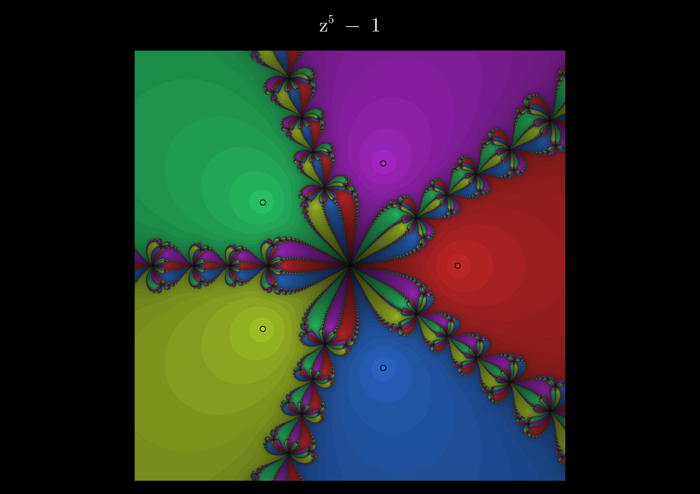

# fractal-roots

Visualize Newton's method basins of attraction for complex polynomials.

For each point in a region of the complex plane, Newton's method is iterated until it converges to a root of the polynomial. Each pixel is colored by which root it converges to, with brightness modulated by how many iterations it took.



More examples in the `images/` folder.

## Usage

```sh
julia --project=. -t auto newton.jl
```

The polynomial, grid resolution, and viewing window are set as constants near the bottom of `newton.jl`. Edit them and re-run to render a different fractal. Output is written to `newton.png`.

## Dependencies

- [CairoMakie](https://docs.makie.org/) — rendering
- [Polynomials.jl](https://juliamath.github.io/Polynomials.jl/) — polynomial representation and root finding
- [Colors.jl](https://github.com/JuliaGraphics/Colors.jl), [LaTeXStrings.jl](https://github.com/JuliaStrings/LaTeXStrings.jl)

Run `julia --project=. -e 'using Pkg; Pkg.instantiate()'` to install.

## How this was built

This project was written as a Julia learning exercise. I had had a day of classes to teach and academic meetings to attend (8am-10pm) and my mind was gone. I wanted to do some light coding on a fun project, without having to wade through pages of documentation myself. So I instructed Claude to act as architect: proposing the next increment, suggesting which Julia idioms or packages to reach for, and reviewing the result, while I wrote the code. It was fun, it reminded me of the early days pair programming with an experienced and patient colleague.
